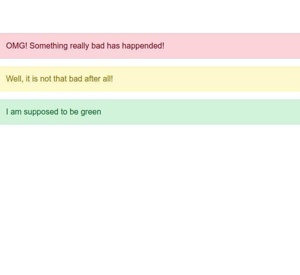

# 10. Bedingtes Rendering (Teil II)

Im Moment kann diese `<Alert>`-Komponente in **Orange** oder **Rot** dargestellt werden, je nach dem Wert der Eigenschaft `color`.

# :speech_balloon: Anleitung

Bitte füge die Möglichkeit hinzu, die Farbe als **grün** anzugeben.

[bootstrap alert](https://getbootstrap.com/docs/5.2/components/alerts/)

Deine Website muss am Ende ähnlich aussehen wie diese:

